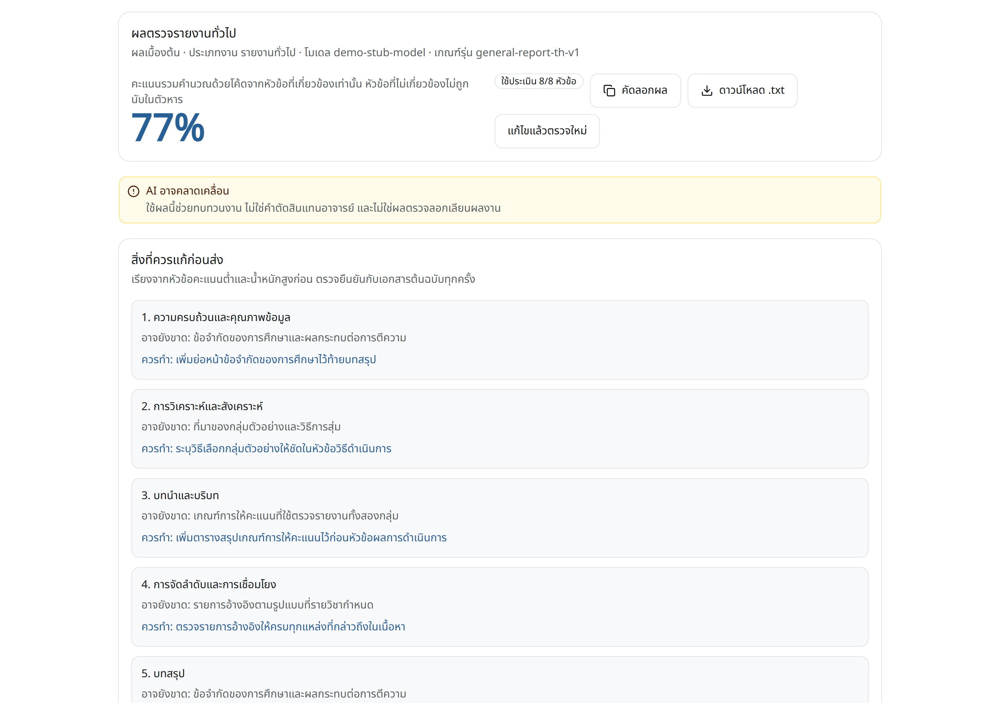
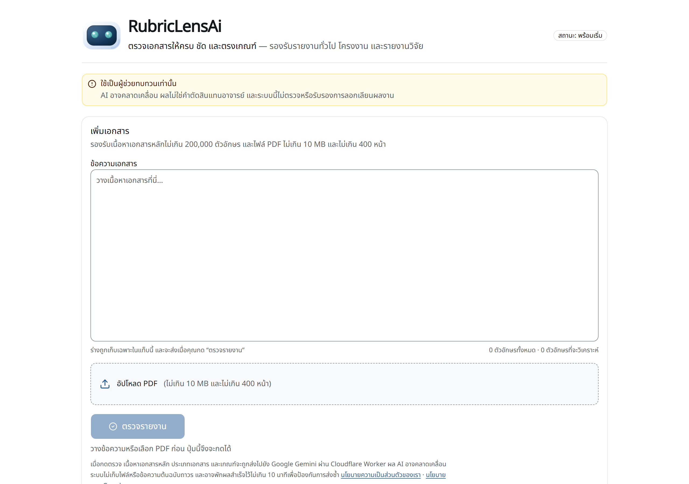
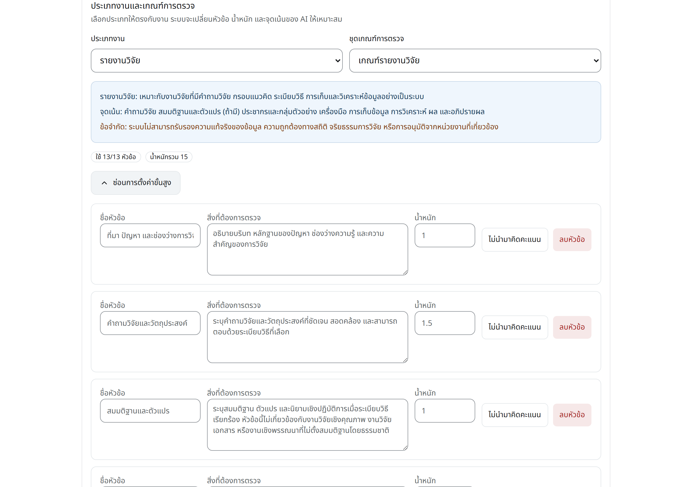
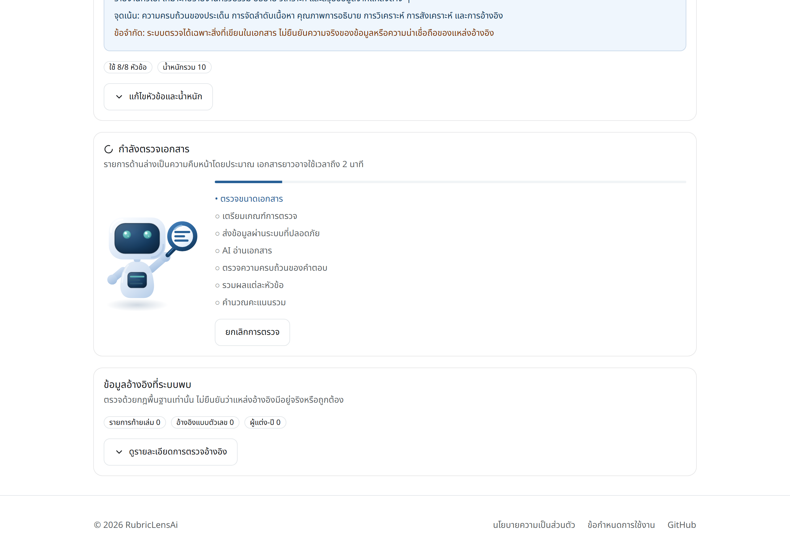
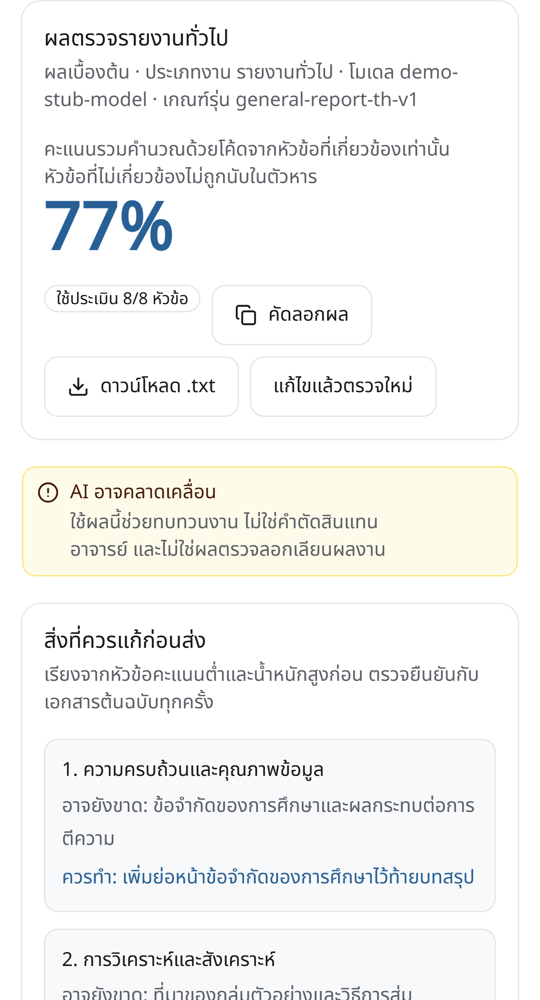
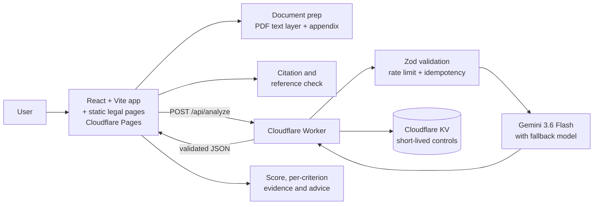

<div align="center">


# RubricLensAi

**Paste a report, define the rubric, get a weighted score with the evidence behind every judgement.**

[**Live demo**](https://rubriclensai.pages.dev/) · [Architecture](docs/architecture.md) · [Deployment runbook](docs/deployment-runbook.md) · [Security](SECURITY.md) · [อ่านฉบับภาษาไทย](README.th.md)

[](https://github.com/WayuOHm99/rubriclens-ai/actions/workflows/ci.yml)
[](https://rubriclensai.pages.dev/)
[](docs/testing-report.md)
[](LICENSE)

</div>



> The UI is Thai, because the users are Thai students and lecturers. Every screenshot in this
> README is captured against a stubbed API (`demo-stub-model`) with an invented report, so no
> real document or live model call appears anywhere in this repository.

---

## What it does

A student finishes a report and has no cheap way to answer one question: *is anything the rubric
asks for actually missing?* Re-reading your own work does not surface a gap you never knew to look
for, and a lecturer's feedback arrives after the deadline.

RubricLensAi takes the text (typed, pasted, or extracted from a PDF text layer), takes a rubric the
user can edit, and returns a weighted score per criterion **with the evidence it found, what it
believes is missing, and what to do about it** — ordered so the highest-weight weakness is first.

It is deliberately positioned as **a reviewer, not a judge**: every result ships with the evidence
so the user verifies it against the original document instead of trusting a number.

## Engineering highlights

The interesting parts of this project are not the CRUD; they are the failure paths.

| Decision | Why it matters |
| --- | --- |
| **The model never computes the score** | Gemini grades each criterion; `shared/scoring.ts` — one formula, used by both the Worker and the browser — computes the weighted total. The arithmetic is deterministic, testable and cannot drift with a prompt change. |
| **"Not applicable" removes weight from the denominator** | A qualitative study has no hypothesis section. Marking that criterion N/A drops it from *both* numerator and denominator, so a report is never punished for a section its own genre does not require. If every criterion is N/A the API returns `overallScore: null`, not a misleading `0`. |
| **The server erases evidence from N/A sections** | A model that marks a section irrelevant will still happily invent a quote for it. The Worker clears `evidence`, `missing` and `score` on those sections, and the browser *rejects* any N/A section that still carries them. |
| **Long documents get a two-stage pass** | Chunk pass reads each part with positional context; a consolidation pass then judges the rubric across the whole document from the **structured findings only**, never by re-sending the text or by taking the best-scoring chunk. If consolidation fails, the API returns `CONSOLIDATION_FAILED` instead of quietly reporting a partial score. |
| **Idempotency is bound to the payload, not the key** | The stored record holds a SHA-256 digest of the canonical request. Same key + same payload replays the cached result; same key + *different* payload returns `409 IDEMPOTENCY_CONFLICT` — a replayed key can never hand back another document's result. The body is validated before anything touches KV. |
| **The client/server contract is versioned** | `apiVersion` is stamped by the Worker, checked by the browser, and partitions the idempotency cache. Responses from an older server are parsed by a separate schema, upgraded explicitly, and flagged to the user rather than silently reinterpreted. |
| **Cost is budget-checked before the call** | Every model call reserves a conservative budget using real `countTokens` output plus a rubric-sized `maxOutputTokens` limit — separately for the chunk pass, the consolidation pass, JSON-retry and the fallback model. This is a best-effort operational guard, not a transactional hard billing cap: KV counters can briefly lag or race, and provider-side retries may still consume work. |
| **PDF input bounds size and work** | The browser checks 10 MB and 400 pages before extraction, then stops when cumulative raw/output text or text-item work exceeds 300,000. Line grouping no longer grows quadratically. PDF.js must still materialize the current page's items first, so these bounds reduce risk rather than promise that a pathological single page can never stall the tab. |
| **Sending the appendix is an explicit consent step** | Detecting an appendix stops the flow *before* the network request and asks, in an accessible dialog, whether to send it. |

## Screenshots

|  |  |
| --- | --- |
| **Empty state** — the whole flow is one screen<br> | **Rubric editor** — titles, criteria and weights are editable<br> |
| **In progress** — estimated steps, cancellable<br> | **Phone** — same result, no horizontal scroll<br> |

Regenerate them all with `npm run screenshots` — they are captured by Playwright from the real
production build, so they cannot silently go stale after a UI change.

## Architecture



### Request lifecycle

1. The browser accepts text or extracts a PDF text layer, and the user can edit it before sending.
2. Size, appendix, references and rubric are validated client-side.
3. On confirmation, only the main body is posted to the Worker.
4. The Worker validates with Zod, enforces rate limit / idempotency / token budget, then calls Gemini.
5. The Worker validates the model response, normalizes applicability, and **computes the score in code**.
6. The browser checks `apiVersion` and schema, recomputes the total to confirm the server agrees, and only then renders.

There is no database, by design. KV holds operational, cost and quality counters, a short health
cache, and 10-minute idempotency records. Full notes, including the *"which files are fragile and why"* table, are in
[docs/architecture.md](docs/architecture.md).

## Tech stack

| Layer | Choice |
| --- | --- |
| Frontend | React 19, TypeScript, Vite, Tailwind CSS, shadcn-style UI |
| Documents | PDF.js text-layer extraction, appendix detection, deterministic citation checks |
| Backend | Cloudflare Worker, Zod, Cloudflare KV |
| AI | Google Gemini (`gemini-3.6-flash`, falling back to `gemini-3.5-flash-lite`) — called only from the Worker, never from the browser |
| Testing | Vitest, React Testing Library, Playwright, oxlint, TestSprite |
| Hosting | Cloudflare Pages + Cloudflare Workers |

## Quality gates

`npm run verify` runs the same quality gates as CI. Latest local run on this source (8 August 2026):

| Check | Command | Result |
| --- | --- | ---: |
| Static analysis | `npm run lint` | passed |
| Unit + component | `npm run test` | **198 / 198** |
| Worker bundle and bindings | `npm run worker:check` | passed |
| Production dependency audit | `npm run audit:prod` | **found 0 vulnerabilities**<sup>†</sup> |
| Production build | `npm run build` | passed |
| Cross-browser E2E | `npm run test:e2e` | **96 / 96** |

E2E runs against the artefact `npm run build` produced, served by `vite preview` — not a dev server —
across Chromium, Mobile Chrome (Pixel 5), Firefox and WebKit.

<sup>†</sup> This gate checks packages shipped to production and fails on high or critical findings.
A separate full-tree `npm audit`, including development tools, also reported **0 vulnerabilities**
after explicit `wrangler` and `nanoid` maintenance updates; see
[docs/testing-report.md](docs/testing-report.md).

The suite covers the failure paths, not just the happy one: idempotency conflicts, v0/v1 cache
separation, rate limits, CORS, Gemini retry and fallback, two-stage consolidation, token-budget
reservation, the 400-page PDF guard, cancellation and cleanup, appendix confirmation, and N/A
presentation.

> These numbers describe **this source tree**. What is currently deployed is tracked separately in
> [docs/testing-report.md](docs/testing-report.md), together with an explicit list of what the tests
> do *not* certify — academic correctness, plagiarism, and agreement with a human grader's judgement
> are all outside their scope.

> This table records a local verification run. Remote CI and production smoke results are separate
> evidence and must be recorded only after those checks actually run.

## Run it locally

Requires Node.js 24+ and npm.

```bash
npm install
cp .env.example .env      # Windows: copy .env.example .env
npm run dev               # http://localhost:5173
```

Without production environment variables the app uses a mock analysis, so the whole flow is
explorable with no API key and no cost.

To exercise the real Worker path:

```bash
# Create .dev.vars (already git-ignored) and add: GEMINI_API_KEY=<your-local-key>
npm run worker:dev        # run alongside `npm run dev`
```

Never put a Gemini key in `VITE_*`, source, or commit history. Keep the local value only in the
git-ignored `.dev.vars` file — see [SECURITY.md](SECURITY.md).

> `npx wrangler secret put GEMINI_API_KEY` is **not** a local setup command. It creates a new Worker
> version and deploys it to production immediately, so run it only with explicit production-change
> approval; see the [deployment runbook](docs/deployment-runbook.md#3-secret-changes-only-when-needed-changes-production).

```bash
npm run verify            # the same quality gates as CI
npm run test              # fast unit loop
npm run test:e2e          # rebuild + cross-browser E2E
npm run screenshots       # regenerate docs/screenshots
```

## Deployment

Order matters: **Worker first, then Pages.** The Worker answers the old v0 shape for a Pages build
that has not rolled over yet, and v1 for clients that send `X-RubricLensAi-Api-Version`, so there is
no window where the two sides disagree about the contract.

```text
Worker dry-run → Worker deploy → health/contract smoke → Pages deploy → browser smoke → TestSprite
```

`wrangler.jsonc` is the single source of truth for the model list, KV binding and non-secret vars.
`GEMINI_API_KEY` lives only in a Worker Secret. Editing production config in the Cloudflare dashboard
has broken this project before — that incident is written up in [LESSONS.md](LESSONS.md). Full steps
and rollback: [docs/deployment-runbook.md](docs/deployment-runbook.md).

An hourly cron trigger asks Google whether the key still works, because a deleted key is
indistinguishable from a working one until somebody submits a document. It writes to Workers Logs
always, and pushes to the optional `ALERT_WEBHOOK_URL` secret when one is set. To ask the same
question by hand:

```bash
curl -s 'https://rubriclensai-api.oomzazato01.workers.dev/api/health?verify=ai'
```

## Repository map

```text
src/                 React app, UI state and domain logic
src/components/ui/   shadcn-style primitives (imported through the `@/` alias)
src/pages/           Privacy policy and terms of service, built as their own HTML entries
shared/              API contract, scoring formula and document types — used by both sides
worker/              Cloudflare Worker API and server-side validation
e2e/                 Playwright flows across desktop, mobile and three browser engines
scripts/screenshots/ Playwright capture run for the images in this README
public/              Static assets, security headers, sitemap, 404 page, social preview
docs/                Architecture, deployment runbook, testing report, screenshots
.testsprite/         TestSprite project config and 11 scenario plans
.github/workflows/   CI quality gate
```

## Security and privacy

- The API key is a Worker Secret; it is never in the browser bundle.
- The Worker accepts JSON only, caps request bytes before parsing, and validates with Zod first.
- Report text is never logged, and uploaded files are never stored.
- Session drafts live in `sessionStorage` for that tab only.
- KV holds operational, cost and quality counters, a short health cache, and 10-minute idempotency
  records. Only idempotency records may include short evidence excerpts the model quoted; none of
  these records contains the original document or uploaded file.
- Document text, model findings and rubric content are all treated as untrusted input in every prompt.
- No cookies, no analytics, no third-party scripts — so the site needs no consent banner. The two
  browser storage keys it does use are declared in `src/lib/browser-storage.ts`, which is the same
  source the published policy page renders, and a test fails if the two drift apart.

Published pages: [`/privacy`](https://rubriclensai.pages.dev/privacy) (includes the cookie
disclosure) and [`/terms`](https://rubriclensai.pages.dev/terms). Details: [SECURITY.md](SECURITY.md).

## How this repository is maintained

This project is built with AI coding assistants under an explicit, checked-in contract:

- [`AGENTS.md`](AGENTS.md) — the working rules every assistant must follow: never edit a test to make
  it pass, never claim completion without raw test output, one task per change, discuss before large
  refactors. ([`CLAUDE.md`](CLAUDE.md) just points at it, so there is one source of truth.)
- [`LESSONS.md`](LESSONS.md) — post-mortems of things that actually broke here, each tied to the
  commit that fixed it, so the same mistake is not repeated.
- [`docs/architecture.md`](docs/architecture.md) — includes a ranked table of the fragile files,
  measured by *how silently they can break*, and the rule that follows from each.

## Project status

A portfolio / MVP project. The AI output is advisory: it does not certify academic correctness,
plagiarism status, or compliance with any particular course rubric.

## License

[MIT](LICENSE) © WayuOHm99
