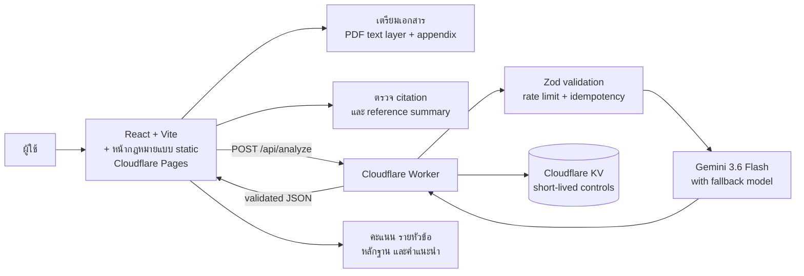

<div align="center">


# RubricLensAi

**วางข้อความรายงาน กำหนดเกณฑ์เอง แล้วรับคะแนนถ่วงน้ำหนักพร้อมหลักฐานที่ AI ใช้ตัดสินทุกข้อ**

[**เปิดเว็บจริง**](https://rubriclensai.pages.dev/) · [สถาปัตยกรรม](docs/architecture.md) · [ขั้นตอน deploy](docs/deployment-runbook.md) · [ความปลอดภัย](SECURITY.md) · [Read in English](README.md)

[](https://github.com/WayuOHm99/rubriclens-ai/actions/workflows/ci.yml)
[](https://rubriclensai.pages.dev/)
[](docs/testing-report.md)
[](LICENSE)

</div>


> ทุกภาพใน README นี้เก็บจาก production build จริง แต่ดักคำตอบ API ไว้ในเครื่อง (ขึ้นชื่อโมเดลว่า
> `demo-stub-model`) และใช้รายงานที่แต่งขึ้นทั้งหมด จึงไม่มีเอกสารจริงหรือการเรียกโมเดลจริงอยู่ใน repo นี้

---

## โปรเจกต์นี้ทำอะไร

นักศึกษาเขียนรายงานเสร็จแล้วตอบคำถามเดียวนี้ได้ยากมาก: *มีอะไรที่เกณฑ์ต้องการแต่ยังไม่ได้เขียนหรือเปล่า?*
การอ่านงานตัวเองซ้ำไม่ช่วยให้เจอสิ่งที่ไม่รู้ว่าต้องมองหา ส่วนคอมเมนต์จากอาจารย์มักมาถึงหลังกำหนดส่ง

RubricLensAi รับข้อความ (พิมพ์ วาง หรือดึงจาก text layer ของ PDF) รับเกณฑ์ที่ผู้ใช้แก้ได้เอง
แล้วคืนคะแนนถ่วงน้ำหนักรายหัวข้อ **พร้อมหลักฐานที่พบ สิ่งที่อาจยังขาด และสิ่งที่ควรทำ** โดยเรียงให้
หัวข้อที่น้ำหนักสูงและคะแนนต่ำขึ้นก่อน

ระบบวางตัวเป็น **ผู้ช่วยทบทวน ไม่ใช่ผู้ตัดสิน** ทุกผลลัพธ์จึงแสดงหลักฐานกำกับ เพื่อให้ผู้ใช้ตรวจเทียบกับ
เอกสารต้นฉบับแทนที่จะเชื่อตัวเลขอย่างเดียว

## จุดที่น่าสนใจเชิงวิศวกรรม

ส่วนที่ยากของโปรเจกต์นี้ไม่ใช่การรับส่งข้อมูล แต่คือ **เส้นทางตอนระบบพัง**

| การตัดสินใจ | ทำไมถึงสำคัญ |
| --- | --- |
| **โมเดลไม่ได้เป็นคนคิดคะแนน** | Gemini ให้คะแนนรายหัวข้อ ส่วน `shared/scoring.ts` — สูตรชุดเดียวที่ Worker และ browser ใช้ร่วมกัน — เป็นคนคำนวณคะแนนรวม การคำนวณจึงตรวจสอบได้และไม่เพี้ยนตามการแก้ prompt |
| **หัวข้อ "ไม่เกี่ยวข้อง" ถูกถอดออกจากตัวหารด้วย** | งานวิจัยเชิงคุณภาพไม่ต้องมีสมมติฐาน การทำเครื่องหมาย N/A จึงถอดหัวข้อนั้นออกจาก**ทั้งตัวตั้งและตัวหาร** งานจึงไม่ถูกหักคะแนนเพราะหัวข้อที่ธรรมชาติของงานไม่ต้องมี และถ้าทุกหัวข้อเป็น N/A ระบบคืน `overallScore: null` ไม่ใช่ `0` ที่ทำให้เข้าใจผิด |
| **เซิร์ฟเวอร์ล้างหลักฐานของหัวข้อ N/A ทิ้ง** | โมเดลที่บอกว่าหัวข้อไม่เกี่ยวข้อง ยังกุข้อความอ้างอิงให้หัวข้อนั้นได้อยู่ดี Worker จึงล้าง `evidence` `missing` และ `score` ทิ้ง และ browser **ปฏิเสธ** หัวข้อ N/A ที่ยังมีค่าเหล่านี้ติดมา |
| **เอกสารยาววิเคราะห์สองขั้น** | ขั้นแรกอ่านทีละส่วนพร้อมบอกว่ากำลังอ่านส่วนที่เท่าไร ขั้นที่สองสรุปรวมทั้งเอกสารจาก **structured findings เท่านั้น** ไม่ส่งข้อความซ้ำ และไม่ใช้วิธีเลือกคะแนนสูงสุดจาก chunk ถ้าขั้นสรุปรวมล้มเหลว ระบบคืน `CONSOLIDATION_FAILED` แทนที่จะเงียบ ๆ แสดงคะแนนที่ไม่ครบ |
| **กันส่งซ้ำด้วย digest ของคำขอ ไม่ใช่แค่ key** | record ที่เก็บมี SHA-256 ของคำขอที่ผ่าน validation แล้ว key เดิม + payload เดิม = คืนผลเดิม ส่วน key เดิม + payload ต่าง = `409 IDEMPOTENCY_CONFLICT` จึงเป็นไปไม่ได้ที่ key ซ้ำจะคืนผลของเอกสารคนอื่น และ body ถูกตรวจก่อนแตะ KV เสมอ |
| **สัญญาระหว่าง client กับ server มีเลขเวอร์ชัน** | `apiVersion` ถูกประทับโดย Worker ตรวจโดย browser และใช้แยก cache ผลลัพธ์จากเซิร์ฟเวอร์รุ่นเก่าถูก parse ด้วย schema แยก แล้ว upgrade อย่างชัดเจนพร้อมแจ้งผู้ใช้ ไม่ใช่ตีความมั่วแล้วเงียบ |
| **ตรวจงบก่อนเรียกโมเดล** | ทุกครั้งก่อนเรียกโมเดลจะจองงบแบบอนุรักษ์นิยมจาก `countTokens` จริง บวกขีดจำกัด `maxOutputTokens` ตามจำนวนหัวข้อ แยกกันระหว่าง chunk pass, consolidation pass, การลองใหม่เมื่อ JSON ผิดรูป และการรันบน fallback model นี่เป็นด่านปฏิบัติการแบบ best effort ไม่ใช่ hard billing cap เพราะ KV อาจเห็นเหตุการณ์ข้ามภูมิภาคช้าและ retry ภายในผู้ให้บริการยังใช้ทรัพยากรได้ |
| **PDF ถูกจำกัดทั้งขนาดและปริมาณงาน** | ระบบตรวจขนาดไฟล์ 10 MB กับ 400 หน้าก่อนอ่าน และหยุดระหว่าง extraction เมื่อเกิน 300,000 ตัวอักษรหรือ text items พร้อมตัดลูปจัดบรรทัดแบบกำลังสองออก อย่างไรก็ตาม PDF.js ยังต้องสร้าง items ของหน้าปัจจุบันก่อนโค้ดนับได้ จึงเป็นการจำกัดความเสี่ยง ไม่ใช่คำรับรองว่า PDF ซับซ้อนหน้าเดียวจะไม่ทำให้แท็บสะดุดเลย |
| **การส่งภาคผนวกต้องยืนยันอย่างชัดเจน** | เมื่อตรวจพบภาคผนวก ระบบหยุด **ก่อน** ยิง request แล้วถามผ่าน dialog ที่เข้าถึงได้ว่าจะส่งหรือไม่ |

## ภาพหน้าจอ

|  |  |
| --- | --- |
| **หน้าเริ่มต้น** — ทั้ง flow อยู่ในหน้าเดียว<br> | **แก้เกณฑ์** — แก้ชื่อหัวข้อ เกณฑ์ และน้ำหนักได้<br> |
| **กำลังตรวจ** — บอกความคืบหน้าและยกเลิกได้<br> | **บนมือถือ** — ผลเดียวกัน ไม่มีการเลื่อนแนวนอน<br> |

สร้างภาพใหม่ทั้งหมดด้วย `npm run screenshots` ภาพถูกเก็บด้วย Playwright จาก production build จริง
แต่คำสั่งนี้ไม่ได้อยู่ใน `npm run verify` หรือ CI ภาพจึงอาจเก่าหลังแก้ UI จนกว่าผู้ดูแลจะสร้างใหม่และตรวจด้วยตา

## สถาปัตยกรรม



### ลำดับการทำงานของหนึ่งคำขอ

1. Browser รับข้อความหรือดึง text layer จาก PDF และผู้ใช้แก้ไขข้อความได้ก่อนส่ง
2. ตรวจขนาดเอกสาร ภาคผนวก การอ้างอิง และเกณฑ์ ตั้งแต่ใน browser
3. เมื่อผู้ใช้ยืนยัน จึงส่ง **เฉพาะเนื้อหาหลัก** ไปยัง Worker
4. Worker ตรวจด้วย Zod คุม rate limit / idempotency / งบ token แล้วจึงเรียก Gemini
5. Worker ตรวจ schema ของคำตอบ จัดการกฎ N/A และ **คำนวณคะแนนด้วยโค้ด**
6. Browser ตรวจ `apiVersion` และ schema แล้วคำนวณคะแนนซ้ำเพื่อยืนยันว่าตรงกับที่ Worker ส่งมา ก่อนแสดงผล

**ไม่มีฐานข้อมูล โดยตั้งใจ** KV เก็บตัวนับการใช้งาน/งบ/คุณภาพ, health cache อายุสั้น และผล idempotency อายุ 10 นาที
รายละเอียดทั้งหมด รวมถึงตาราง *"จุดเปราะ — แก้ตรงไหนแล้วเสี่ยงพังที่อื่น"* อยู่ใน
[docs/architecture.md](docs/architecture.md)

## เครื่องมือที่ใช้

| ชั้น | สิ่งที่ใช้ |
| --- | --- |
| หน้าเว็บ | React 19, TypeScript, Vite, Tailwind CSS, shadcn-style UI |
| งานเอกสาร | PDF.js อ่าน text layer, ตรวจภาคผนวก, ตรวจการอ้างอิงด้วยกฎที่คงที่ |
| หลังบ้าน | Cloudflare Worker, Zod, Cloudflare KV |
| AI | Google Gemini (`gemini-3.6-flash` และ fallback `gemini-3.5-flash-lite`) เรียกจาก Worker เท่านั้น ไม่เรียกจาก browser |
| ทดสอบ | Vitest, React Testing Library, Playwright, oxlint, TestSprite |
| โฮสต์ | Cloudflare Pages + Cloudflare Workers |

## ด่านคุณภาพ

`npm run verify` รันด่านคุณภาพชุดเดียวกับ CI ผลล่าสุดบนซอร์สชุดนี้ (9 สิงหาคม 2026):

| ตรวจอะไร | คำสั่ง | ผล |
| --- | --- | ---: |
| ตรวจโค้ดแบบสถิต | `npm run lint` | ผ่าน |
| Unit + component + Worker | `npm run test` | **264 / 264** |
| ชนิดข้อมูล Worker, generated bindings และ dry-run bundle | `npm run worker:check` | ผ่าน |
| ตรวจช่องโหว่ของ dependency ที่ใช้จริง | `npm run audit:prod` | **ไม่พบช่องโหว่ (0 รายการ)**<sup>†</sup> |
| Production build | `npm run build` | ผ่าน |
| E2E ข้ามเบราว์เซอร์ | `npm run test:e2e` | **96 / 96** |

E2E รันบน artefact ที่ `npm run build` สร้าง แล้วเสิร์ฟด้วย `vite preview` (ไม่ใช่ dev server)
ครอบคลุม Chromium, Mobile Chrome (Pixel 5), Firefox และ WebKit

<sup>†</sup> ด่านนี้ตรวจเฉพาะแพ็กเกจที่ส่งไปใช้งานจริง และจะไม่ผ่านเมื่อเจอระดับ high หรือ critical
ส่วน `npm audit` ที่ตรวจรวมเครื่องมือพัฒนาด้วยก็รายงาน **0 vulnerabilities** หลังอัปเดต
`wrangler` และ `nanoid` แบบระบุแพ็กเกจชัดเจน รายละเอียดอยู่ใน
[docs/testing-report.md](docs/testing-report.md)

ชุดทดสอบครอบคลุมเส้นทางที่ระบบพัง ไม่ใช่แค่เส้นทางปกติ: idempotency conflict, การแยก cache v0/v1,
rate limit, CORS, การ retry และ fallback ของ Gemini, การสรุปรวมสองขั้น, การกันงบ token,
ด่าน PDF 400 หน้า, การยกเลิกและการเก็บกวาด, การยืนยันภาคผนวก และการแสดงผลหัวข้อ N/A

> ตัวเลขข้างบนเป็นของ **ซอร์สชุดนี้** ส่วนสิ่งที่ deploy อยู่จริงบันทึกแยกไว้ที่
> [docs/testing-report.md](docs/testing-report.md) พร้อมรายการสิ่งที่การทดสอบ **ไม่ได้** รับรอง เช่น
> ความถูกต้องเชิงวิชาการ การลอกเลียนผลงาน และความตรงกับดุลพินิจของผู้ประเมินที่เป็นมนุษย์

> ตารางนี้บันทึกผลตรวจในเครื่อง ส่วนผล CI และ production smoke เป็นหลักฐานคนละชุด
> และต้องบันทึกต่อเมื่อได้รันจริงแล้วเท่านั้น

## วิธีรันในเครื่อง

ต้องมี Node.js 24 ขึ้นไป และ npm

```bash
npm install
copy .env.example .env    # macOS/Linux ใช้ cp
npm run dev               # http://localhost:5173
```

ถ้าไม่ได้ตั้งค่า production environment variables ระบบจะใช้ mock analysis ทดลองใช้ทั้ง flow ได้
โดยไม่ต้องมี API key และไม่มีค่าใช้จ่าย

ถ้าจะทดสอบเส้นทางที่เรียก Worker จริง:

```bash
# ใน .env ตั้งค่าฝั่ง browser ที่ไม่ใช่ความลับ: VITE_USE_MOCK_ANALYSIS=false
# สร้าง .dev.vars (Git ignore ไว้แล้ว) แล้วใส่ GEMINI_API_KEY=<คีย์สำหรับ local>
npm run worker:dev        # http://127.0.0.1:8787; รันคู่กับ npm run dev
```

Vite จะส่งคำขอ `/api` ที่มาจาก browser ไปยัง Worker ในเครื่อง ถ้าไม่ได้รันคำสั่ง Worker หน้าเว็บจะแจ้ง
network error และจะไม่ถอยไปเรียก Worker production เอง

ห้ามใส่ Gemini key ใน `VITE_*`, source code หรือ commit history ค่า local ให้อยู่เฉพาะใน `.dev.vars`
ที่ Git ignore — ดู [SECURITY.md](SECURITY.md)

> `npx wrangler secret put GEMINI_API_KEY` **ไม่ใช่คำสั่งตั้งค่า local** คำสั่งนี้สร้าง Worker version
> และ deploy ขึ้น production ทันที ต้องได้รับอนุมัติการเปลี่ยน production ก่อนทุกครั้ง ดู
> [deployment runbook](docs/deployment-runbook.md#3-secret-changes-only-when-needed-changes-production)

```bash
npm run verify            # ด่านคุณภาพชุดเดียวกับ CI
npm run test              # ชุดเร็วระหว่างทำงาน
npm run test:e2e          # build ใหม่แล้วรัน E2E ข้ามเบราว์เซอร์
npm run screenshots       # สร้างภาพใน docs/screenshots ใหม่
```

## การ deploy

ลำดับสำคัญ: **Worker ก่อน แล้วจึง Pages** Worker ตอบ v0 shape ให้ Pages รุ่นเก่าที่ยังไม่เปลี่ยน
และตอบ v1 ให้ client ที่ส่ง `X-RubricLensAi-Api-Version` จึงไม่มีช่วงที่สองฝั่งเข้าใจสัญญาไม่ตรงกัน

```text
recovery/off-device checkpoint → local gates → Worker dry-run → secret change (ถ้าจำเป็นและได้รับอนุมัติ) → Worker deploy → health/contract smoke → Pages deploy → browser smoke → TestSprite
```

`wrangler.jsonc` คือแหล่งความจริงเดียวของรายชื่อโมเดล, KV binding และ variable ที่ไม่ใช่ความลับ
ส่วน production เก็บ `GEMINI_API_KEY` ใน Worker Secret เท่านั้น **การแก้ค่า production จากหน้า Cloudflare
dashboard เคยทำให้โปรเจกต์นี้พังมาแล้ว** บันทึกไว้ใน [LESSONS.md](LESSONS.md)
ขั้นตอนเต็มและวิธี rollback อยู่ที่ [docs/deployment-runbook.md](docs/deployment-runbook.md)

ระบบมีตัวเฝ้าอัตโนมัติ (cron ทุกชั่วโมง) คอยถาม Google ว่า key ยังใช้ได้ไหม เพราะ key ที่ถูกลบแล้ว
หน้าตาเหมือน key ที่ใช้ได้ทุกประการจนกว่าจะมีคนส่งเอกสารเข้ามาตรวจ ถ้าตรวจไม่ผ่าน ระบบจะพยายามส่ง webhook และเขียน cache ก่อนทำให้ scheduled invocation ขึ้น failed ใน Cron Past Events แม้ไม่ได้ตั้ง webhook ส่วน Workers Logs ยังขึ้นกับอัตรา sampling ที่ตั้งไว้
และถ้าตั้ง secret `ALERT_WEBHOOK_URL` ไว้ก็จะส่งข้อความไปที่ URL นั้นด้วย ถ้าอยากถามเองทันที:

```bash
curl -s 'https://rubriclensai-api.oomzazato01.workers.dev/api/health?verify=ai'
```

## แผนผังโฟลเดอร์

```text
src/                 React app, UI state และ domain logic
src/components/ui/   ชิ้นส่วน UI แบบ shadcn (เรียกผ่านชื่อย่อ `@/`)
src/pages/           หน้านโยบายความเป็นส่วนตัวและข้อกำหนดการใช้งาน build เป็นหน้า HTML ของตัวเอง
shared/              API contract, สูตรคะแนน และนิยามประเภทเอกสาร ใช้ร่วมกันสองฝั่ง
worker/              Cloudflare Worker API และ validation ฝั่งเซิร์ฟเวอร์
e2e/                 Playwright flows บน desktop/mobile และ 3 browser engine
scripts/screenshots/ สคริปต์เก็บภาพหน้าจอสำหรับเอกสาร
public/              static assets, security headers, sitemap, หน้า 404 และ social preview
docs/                สถาปัตยกรรม, ขั้นตอน deploy, รายงานการทดสอบ, ภาพหน้าจอ
.testsprite/         config และ 11 scenario plans ของ TestSprite
.github/workflows/   CI quality gate
```

## ความปลอดภัยและความเป็นส่วนตัว

- API key อยู่ใน Worker Secret ไม่เคยอยู่ใน bundle ของ browser
- Worker รับ JSON เท่านั้น จำกัดขนาด request ก่อน parse และตรวจด้วย Zod เป็นอย่างแรก
- ไม่ log เนื้อหารายงาน และไม่เก็บไฟล์ที่อัปโหลด
- ร่างของผู้ใช้อยู่ใน `sessionStorage` ของแท็บนั้นเท่านั้น
- KV เก็บตัวนับการใช้งาน/งบ/คุณภาพ, health cache อายุสั้น และผล idempotency อายุ 10 นาที เฉพาะผล
  idempotency อาจมีข้อความอ้างอิงสั้น ๆ ที่ AI ยกมา แต่ไม่มีข้อมูลใดเก็บเอกสารต้นฉบับหรือไฟล์ที่อัปโหลด
- ข้อความเอกสาร ผลจากโมเดล และเนื้อหาเกณฑ์ ถูกปฏิบัติเป็น untrusted input ในทุก prompt
- ไม่มีคุกกี้ ไม่มีระบบเก็บสถิติ ไม่มีสคริปต์จากภายนอก จึงไม่ต้องมีแถบขอความยินยอม ส่วนคีย์ที่เก็บใน
  เบราว์เซอร์ 2 ตัวประกาศไว้ที่ `src/lib/browser-storage.ts` ซึ่งเป็นแหล่งเดียวกับที่หน้านโยบายอ่านไปแสดง
  และมี test คุมไม่ให้ทั้งสองหลุดจากกัน

หน้าที่เผยแพร่: [`/privacy`](https://rubriclensai.pages.dev/privacy) (รวมเรื่องคุกกี้ไว้ในหน้านี้)
และ [`/terms`](https://rubriclensai.pages.dev/terms) — รายละเอียด: [SECURITY.md](SECURITY.md)

## โปรเจกต์นี้ดูแลยังไง

โปรเจกต์นี้พัฒนาร่วมกับผู้ช่วย AI ภายใต้กติกาที่เขียนไว้ชัดเจนและ commit ลง repo:

- [`AGENTS.md`](AGENTS.md) — กติกาที่ผู้ช่วย AI ทุกตัวต้องทำตาม: ห้ามแก้ test เพื่อให้ผ่าน,
  ห้ามอ้างว่าเสร็จโดยไม่มีผลรันดิบ, หนึ่งงานหนึ่งการเปลี่ยนแปลง, งานใหญ่ต้องคุยก่อนเขียน
  ([`CLAUDE.md`](CLAUDE.md) เป็นแค่ตัวชี้ไปที่ไฟล์นี้ เพื่อให้มีแหล่งความจริงเดียว)
- [`LESSONS.md`](LESSONS.md) — บันทึกสิ่งที่เคยพังจริงในโปรเจกต์นี้ ผูกกับ commit ที่แก้ทุกข้อ
  เพื่อไม่ให้พลาดซ้ำ
- [`docs/architecture.md`](docs/architecture.md) — มีตารางจัดอันดับไฟล์ที่เปราะที่สุด
  โดยวัดจาก **โอกาสที่จะพังแบบเงียบ ๆ** พร้อมกฎปฏิบัติของแต่ละข้อ

## สถานะโปรเจกต์

เป็นโปรเจกต์ portfolio / MVP ผลจาก AI เป็นเพียงคำแนะนำ ไม่ใช่การรับรองความถูกต้องทางวิชาการ
ไม่ใช่การตรวจการลอกเลียนผลงาน และไม่ใช่การรับรองว่าตรงตามเกณฑ์ของรายวิชาใด

## สัญญาอนุญาต

[MIT](LICENSE) © WayuOHm99
